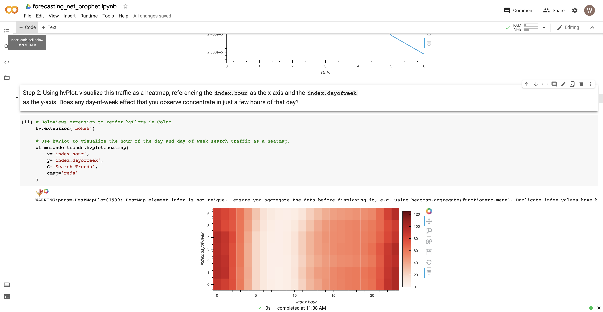

# Module 11 Challenge

This is the repository for my module 11 challenge. In this module challenge, we analyzed financial and user data for MercadoLibre, Latin America e-commerce site.

#### Note for viewer - Please navigate to this Google Colab link to view my notebook: https://colab.research.google.com/drive/1h_t51Yo4afihj97Eh_lBgYWBd4dRGyPG?usp=sharing
#### Due to the file size, I had to make forecasting_net_prophet.ipynb a .zip file. Please download the zip file or navigate to the provided Google Colab link to view the file. 

The first step in this module challenge was to try to find unusual patterns in the hourly Google Treands search data. Next, we mined that search traffic data for seasonality, to try to find predictable patterns for MercadoLibre. The third step was to concatenate the search traffic data with stock price data, in order to find correlations between the two datasets. Next, we created a timeseries model on the search trend data with FB Prophet, to try to make predictions about future trends. The fifth (Optional) and final step was to use sales data combined with FB Prophet to produce a sales forecast for the finance group.

---

## Technologies

Import the following at the beginning of your jupyter notebook:

```python
import pandas as pd
import holoviews as hv
from fbprophet import Prophet
import hvplot.pandas
import datetime as dt
%matplotlib inline
```

---

## Example

This first image shows a heatmap with hour of the day on the x-axis, day of the week on the y-axis, and red color concentration depicting number of search trends.



The following image shows an illustration of the stock volatility of MercadoLibre over time.


This third image shows Prophet the forecast for search trends over the full timeframe, and then the daily, weekly, and yearly trends. 


This final image is from Part 5, and displays the Prophet model for sales forecasts.


---

## Contributors

UCB Fintech Bootcamp, Wynham Guillemot 

---

## License

MIT License

Copyright (c) [2021] [UCB Fintech Bootcamp, Wyham Guillemot]

Permission is hereby granted, free of charge, to any person obtaining a copy
of this software and associated documentation files (the "Software"), to deal
in the Software without restriction, including without limitation the rights
to use, copy, modify, merge, publish, distribute, sublicense, and/or sell
copies of the Software, and to permit persons to whom the Software is
furnished to do so, subject to the following conditions:

The above copyright notice and this permission notice shall be included in all
copies or substantial portions of the Software.

THE SOFTWARE IS PROVIDED "AS IS", WITHOUT WARRANTY OF ANY KIND, EXPRESS OR
IMPLIED, INCLUDING BUT NOT LIMITED TO THE WARRANTIES OF MERCHANTABILITY,
FITNESS FOR A PARTICULAR PURPOSE AND NONINFRINGEMENT. IN NO EVENT SHALL THE
AUTHORS OR COPYRIGHT HOLDERS BE LIABLE FOR ANY CLAIM, DAMAGES OR OTHER
LIABILITY, WHETHER IN AN ACTION OF CONTRACT, TORT OR OTHERWISE, ARISING FROM,
OUT OF OR IN CONNECTION WITH THE SOFTWARE OR THE USE OR OTHER DEALINGS IN THE
SOFTWARE.
